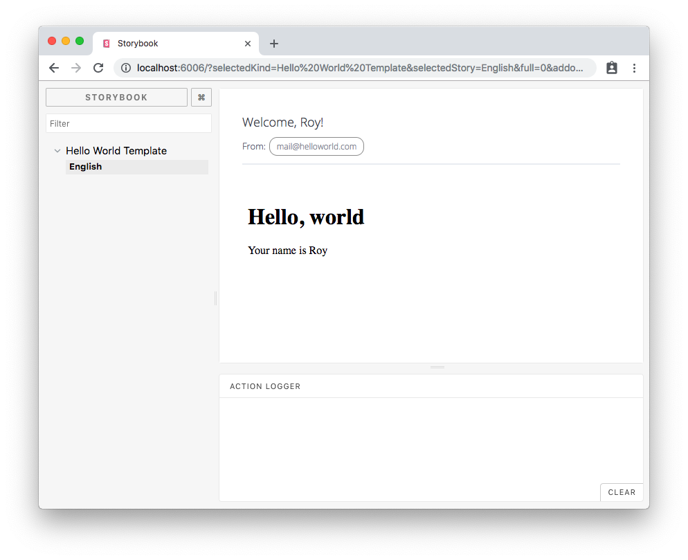

# 
A Ping Email Templates Project

## Quick Start
Run `npm start` and head over to `http://localhost:6006`. You will be able to see the default template rendered with default values:



## Project Structure
- `manifest.json` describes your project's properties and templates, used by Ping to construct your emails properly.
- `templates` contains all the email templates, defined in velocity (*.vm) files.
- `translations` contains i18n Babel-compliant json files for all the supported languages.
- `stories` contains your project's stories. used for locally viewing and testing your email templates.

Other files: `package.json`, `pom.xml` and `assembly.xml` are required for your project to be properly deployed, but should generally be left untouched.

## Setup

### Setting Sender Email
**This should be done once**. Head over to `manifest.json`. The first thing to change is the `fromEmail` value - this is the email that will be used as `sender` when Ping delivers your messages. Make sure to use a domain which you own specifically for that task, e.g.:

```diff
{
- "from": "mail@helloworld.com",
+ "from": "noreply@wixinvoices.com",
  "emails": {
      "helloWorld": {
          "filename": "hello.vm",
          "subjectTranslationKey": "emailSubject"
      }
  }
}
```

This change will be reflected upon refresh in your storybook.

## Usage

### Adding a new template
Firslty, create a new `.vm` file in your `templates` directory. The `vm` file will eventually be rendered into the `html` that will be sent to your recipients.

While working on your template, you will probably want to add new translation keys. You can do that by adding them to `translations/messages_en.json`, much like you do with other frontend projects.

Both the translation keys and the parameters sent with your Ping notification will be available to you on render time and can be used in your template by name. For better reference, see the `hello.vm` example file.

The last step is to register your template in your `manifest.json` file, that way you will be able to use it by name with Ping. It should be put under the `emails` property, and have two values: `filename` which points to the correct file within the `templates` directory, and `subjectTranslationKey` which points to the translation that should be used as the email's subject. Example:

```diff
{
  "from": "noreply@wixinvoices.com",
  "emails": {
      "helloWorld": {
        "filename": "hello.vm",
        "subjectTranslationKey": "emailSubject"
-     }
+     },
+     "invoiceTemplate": {
+       "filename": "invoice.vm",
+       "subjectTranslationKey": "invoiceEmailSubject"
+     }
  }
}
```

### Adding new stories
First of all, if you are not familiar with Storybook, it is recommended to first learn [how to write stories](https://storybook.js.org/basics/writing-stories/).

Your project comes with a preinstalled storybook kit that lets you render your email templates easily, called [ping-email-templates-storybook](https://github.com/wix-private/wixos/tree/master/ping/email-notifications-templates/email-notifications-templates-storybook-kit). Its primary feature is the `anEmailTemplateStory` function.

Start by diving into `stories/index.js`. You will already see an example story there. When adding a template story, you can set its locale (defaults to `en`) and its parameters (defaults to `{}`).
Example:

```javascript
storiesOf('Invoices Template', module)
  .add('Test Story', anEmailTemplateStory('invoiceTemplate') // matches the entry in manifest.json "emails" property
    .withLocale('en') // will use "messages_en.json". defaults to "en"
    .withParams({ sum: 100, currency: '$' }) // parameters that are usually sent with Ping can be set here. defaults to an empty object
    .build()); // The build method creates the story for you, and must be appended to all stories
```

Following that, you storybook should immediately update with the new stories. If you have made some kind of mistake, you will get an error message that tells you exactly what went wrong.

## Deployment
Your email project is a client statics project as any other. First, make sure that your `artifactId` and `groupId` properties are set correctly in your `pom.xml` file. Then, simply push your changes and make sure that you have set it up in lifecycle and chef properly. If you do not know how to add statics projects, the wonderful people at the **`📣 #feds`** Slack channel will be able to help.

## Integrations

### Integrating with Ping
Read about integrating with Ping [here](https://github.com/wix-private/wixos/blob/master/ping/notifications-hub/notifications-hub-api/src/main/proto/docs/email_notifications.md).

### Integrating with Babel
Contact Eitan Avni or Helle Gabler from localization team, provide them the artifactId of the statics project you created for the emails, and ask them to create a new Babel project under the translations folder.

## Further Information
The WixOS team are always available and happy to answer your questions. Visit us at our **`📣 #ping`** Slack channel!
